# InvestSystem 实施计划（v2.5）

> 计划版本：`v2.5`
> 基线日期：`2026-08-08`
> 批准基线：`v0.4 / approved 2026-07-31`
> 文档状态：`active / approved decisions integrated`
> 当前阶段：`Stage 0—2B / completed；Stage 3 / in_progress（3A—3B completed，3C—3D not_started）；Stage 4 / completed_with_scope_limits；Stage 5 / in_progress（5A governance approved，5B—5D not_started）`
> 当前成熟度：`offline_release_admission_kernel_completed / stage2b_synthetic_research_validation_completed / stage3a_pinned_transport_contract_and_offline_clients_completed / stage3b_independent_loopback_http_rc_accepted_without_authority / stage4_complete_synthetic_research_validation_engine_accepted / all_14_stage4_p0_rules_approved / stage5a_approved_rule_identity_and_capability_guard_completed / stage5_business_evaluators_not_implemented / full_production_strategy_not_implemented`
> 当前授权边界：`Stage 2B、Stage 4/4B 与 Stage 5A 均只允许各自精确批准范围内的匿名合成 research validation；Stage 5A capability 只证明规则身份获批，不证明成交、组合、账本、P&L 或 replay 已实现；不授权 backtest、paper、shadow、live、真实仓位、真实账户、真实订单、券商接入或资金部署`

本文是 InvestSystem 仓库唯一正式实施路线图，负责说明阶段、依赖、完成门和验收证据。它不取代 ADR、PRD、规则规格、机器契约、代码、测试报告或运行记录，也不证明任何策略已经实现或有效。

本计划参考 InvestmentResearchKB 的阶段治理方式，但不会复制 KB 的采集、raw、staging、SQLite、审核和发布实现。两个仓库通过正式 Release 契约协作，不通过内部目录或内部代码耦合。

“互不影响”在本文中表示：两个仓库独立构建、测试、发布和保存运行状态；任一仓库的代码、环境、数据库、缓存或 CI 变化都不能隐式改变另一仓库。唯一允许的运行影响是：当 KB Release 缺失、撤回或验证失败时，InvestSystem 的**新运行**必须 fail closed；已经固定并验证的历史输入仍按批准的留存规则离线重放。

KB 协调背景来自会话 `019f8f72-81ac-7182-84d7-2572e988d841` 及其侧边任务；会话只用于追溯当前协作上下文，真正的工程依赖必须固定到 KB 的正式提交、Schema、lock、fixture 和 Published Release。

---

## 1. 当前基线与阶段总览

### 1.1 仓库事实

- 仓库的需求、研究、规则占位、原始材料和历史归档仍是业务内容主体；这些文档不等于实现。
- `2026-07-31` Stage 1 已通过[正式验收](docs/validation/stage1-acceptance.md)：独立包装/依赖锁/TOML、InvestSystem 自有 draft Schema、provider-neutral DTO、规范序列化、强制规则成熟度防线、SQLite/内容寻址缓存与准入骨架、合成 fixture、自动测试和 Windows/Linux CI 均已形成并验证。
- Stage 2A 已通过[正式验收](docs/validation/stage2a-acceptance.md)：从固定 KB 公共契约提交 `58ed9c5cb5302e3e719f1696bed83a03c5d6313b` 按 Git 对象原始字节引入 20 个官方文件，并完成 provider canonical、契约目录、官方 reference fixture 验证/窄投影、消费 Receipt/Observation、显式 Release 留存闭包，以及 SQLite v3 的 run-scoped 当前状态确认、默认拒绝 authority、receipt-derived atomic pin、legacy v2 quarantine 和审计留存。实现提交 `01073c1` 的 GitHub Actions run `30744115034` 在 Windows/Linux 均成功。
- Stage 3A 已在 KB RC 契约提交 `2c84277ef463b5dd9a3fda3f2976a30cade53af5` 完成只读 HTTP Client、不可变导出包验证器和官方 fixture 离线验收。Stage 3B 随后把完整 Stage 6B transport snapshot 重固定到 `aab36fe229104779b50ec71e2dc37a9fad81d285`，并通过独立 KB RC 进程、短期只读凭据的真实本机 HTTP 兼容验收。它没有签发 `RunReleaseStatusConfirmation`，所有输出仍为 `authority_eligible=false`；tcloud、正式 Context Pack 策略 smoke、完整产业策略集成、组合/执行、P&L 和任何真实运行模式仍不存在。
- [产业卡点及事件驱动系统 PRD v0.3](产业卡点及事件驱动系统/01_需求/产业卡点及事件驱动系统_PRD_v0.3.md) 已于 `2026-07-31` 获用户批准并 `supersedes` v0.2；首个最小订单/合同规则包已在 `stage2b_synthetic_validation` scope 内批准并实现，Stage 4 的 14 项 P0 规则也已分四批批准并实现局部 evaluator。独立 4B 完整编排已获得 scope-limited 批准并通过合成验收；v0.2 只作历史追溯。
- owner 已批准 [Stage 5 / 5A 成交、组合、账本与确定性回放精确规则包](产业卡点及事件驱动系统/03_规则与规格/Stage5_5A成交组合账本与确定性回放精确规则包_v0.1.md)第 13 节全部四十项，且只授权 `stage5_synthetic_execution_validation`。原规格和零权限 draft proposal 保持不变；独立[批准记录](产业卡点及事件驱动系统/03_规则与规格/Stage5_5A成交组合账本与确定性回放批准记录_v0.1.md)、approved bundle、approval record 和治理 capability verifier 已形成。Stage 5B—5D 业务 evaluator、持久化和所有真实/交易模式仍不存在。
- 用户于 `2026-08-02` 批准《最小订单合同纵向切片规则包 v0.1》全部 22 项，仅授权 Stage 2B 匿名合成 `research` validation。实现提交 `d5d6003` 和[正式验收](docs/validation/stage2b-acceptance.md)已关闭 Stage 2B；该批准不授权 backtest、paper、shadow、live、仓位或订单。
- [题材扩散与资金轮动系统](题材扩散与资金轮动系统/README.md) 仅完成独立研究建档，需求、规则和实现尚未开始。
- `原始文档/` 是同事提出的设想和材料基线；`归档/` 中的 HTML、截图和旧规格只供追溯，均不得冒充当前实现或验证证据。
- 本计划建立时的 Git 基线为提交 `bf095f4787b045e6518d6d63217b46aebd5b5bd5`，分支为 `main`。
- `origin` 指向 `git@github.com:Zhaosheng-Xie/InvestSystem.git`；`upstream` fetch 指向 `https://github.com/dnaouo/invest_system.git`。当前 clone 已把 upstream push 改为 `disabled://upstream-push-prohibited`，并通过联网前失败的 dry-run 验证。
- 截至 `2026-07-30` 本轮复核，KB 的 `codex/stage6` 工作树干净并与 `origin/codex/stage6` 对齐，当前文档 HEAD 为 `1d6b823`；`6ea33c4` 记录正式验收，`1d6b823` 进一步明确快照边界。KB PLAN v2.20 已正式关闭 Stage 6A。其 provider 实现与公共契约基线为干净提交 `58ed9c5cb5302e3e719f1696bed83a03c5d6313b`，正式验收 Release 为 `rel_10e257ad87734d7bb5cadc55e7b444e7`，Manifest SHA-256 为 `2e7b3bc389316e63bb46c8beea5269fb504d38a0b7dc20ed92939cc58ee2fd21`。但该公网 Release 只有 16 条 `market-daily` 样本；阶段 4/5 的财务、Evidence 与 Context Pack 正式数据仍在 KB 本地活动库，尚未通过正式发布面交付。本次快照只在 tcloud 生成和验证，未复制到第二台机器；异机副本属于 KB 后续灾备/公网生产门，不是 InvestSystem 依赖。不得把“Stage 6A 交付面完成”表述为“全部正式数据已公网部署”。

### 1.2 阶段状态

阶段状态只允许使用：`not_started`、`in_progress`、`blocked`、`completed`、`optional`、`deferred`。

| 阶段 | 状态 | 目标 | 主要依赖 |
|---|---|---|---|
| Stage 0 | `completed` | 治理、边界和需求冻结 | 已于 `2026-07-31` 验收关闭 |
| Stage 1 | `completed` | 工程与机器契约骨架 | 已于 `2026-07-31` 验收关闭 |
| Stage 2A | `completed` | KB 公共契约离线验证、投影、消费持久化与准入内核 | 已于 `2026-08-02` 验收关闭 |
| Stage 2B | `completed` | 最小 approved 策略规格与合成纵向切片 | 已于 `2026-08-02` 通过正式验收；只授权 synthetic research validation |
| Stage 3 | `in_progress` | KB 正式 Release 传输与策略端到端验收 | 3A 离线与 3B 独立本机 HTTP 已完成；3C tcloud、3D 正式 Context Pack 策略 smoke 未开始 |
| Stage 4 | `completed_with_scope_limits` | 完整产业事件规格与策略引擎 | `4A-1—4A-4` 与 `4B` 均已批准并完成匿名合成完整编排、统一结论和 replay 验收；无真实/交易权限 |
| Stage 5 | `in_progress / 5A governance approved` | 成交、组合与确定性回放 | 40 项、approved artifacts 与 capability guard 已完成；5B—5D 业务实现未开始 |
| Stage 6 | `not_started` | 历史验证与冠军挑战 | Stage 3、Stage 5 |
| Stage 7 | `not_started` | 前瞻 shadow/paper 运行 | Stage 6、人工批准 |
| Stage 8 | `optional` | 产业策略受控扩展；实盘仍需另行授权 | Stage 7、新批准 |

题材扩散与资金轮动系统是独立的 deferred track，不属于产业策略 Stage 8 的后继阶段，也不进入上表的串行完成链。

阶段依赖如下：

```text
Stage 0 → Stage 1 → Stage 2A + Stage 2B

Stage 2A + Stage 2B + KB Stage 6A 正式完成
+ Stage 3A 固定 HTTP/export/current-status 公共契约并离线验收
→ Stage 3（正式 Release E2E）──────────────────────┐
                                                   ├→ Stage 6 → Stage 7 → Stage 8
Stage 2A + Stage 2B                                │
→ Stage 4（完整策略引擎）→ Stage 5（组合/执行）────┘

题材系统：独立 deferred track（另行批准、另立阶段，不接在 Stage 8 后）
```

Stage 0 与 Stage 1 已于 `2026-07-31` 关闭，Stage 2A 与 Stage 2B 已于 `2026-08-02` 关闭。owner 曾于 `2026-08-03` 延后 Stage 3，并于 `2026-08-08` 按“固定公共契约 → Client → 官方 fixture 离线验收 → 独立进程本机 HTTP 联调 → tcloud → 正式 Context Pack smoke”的顺序恢复。Stage 3A 已完成；Stage 3B 已使用 KB 精确提交 `aab36fe`、独立 RC 进程和只读凭据通过，且没有借用 KB 工作树、内部包、数据库、mock 或 TestClient。该 RC Release 虽包含 Context Pack 制品，但本轮仅验证 transport compatibility，没有执行 provider-neutral 映射、策略 smoke 或 authority 持久化，因此不构成 3D。Stage 4—5 不等待 3C—3D，Stage 3 与 Stage 5 只在正式历史验证 Stage 6 前汇合。

---

## 2. 项目目标、边界与非目标

### 2.1 项目目标

InvestSystem 是策略、决策、组合和执行验证系统。它消费已经发布的、可验证的 KB Release，把同事提出的投资分析思路逐步转化为：

```text
可追溯需求
→ 已批准规则
→ 版本化机器契约
→ 确定性策略计算
→ 可证伪验证
→ 可审计决策
→ 人工批准后的 shadow/paper 运行
```

第一优先项目是产业卡点及事件驱动系统。题材扩散与资金轮动系统始终作为独立候选 Alpha 项目管理，不混用信号、状态机、参数、回测、P&L 或成功结论。默认实行零信号互通；未来若要把 `theme_regime` 等题材结果作为产业策略的外生特征，必须形成新的 ADR、版本化输入契约和独立验证，不能在实现中暗接。

### 2.2 同事原始设想摘要（非实现）

现有原始文档、研究材料和历史归档主要提出两条不同的候选收益机制：

1. **产业卡点及事件驱动**：先识别供给扩张慢、替代困难、可能形成议价或利润传导的产业约束，再用公告、订单、合同、交付、产能和财务验证等公开事件更新 E0—E7 状态；最终通过真实性、利润重要性、预期差和可成交收益四道门，连接利润桥、估值、仓位与退出。
2. **题材扩散与资金轮动**：研究共同叙事、注意力和资金如何从触发器与龙头向跟随公司扩散，并在拥挤、扩散失败或证伪后衰减；其数据、状态、归因和 P&L 与产业策略独立。

这些内容目前只是产品设想、研究假设和历史案例。事件分级、门槛数值、产业映射、题材状态、收益目标及任何“成功”描述，只有在用户批准规则、实现代码并通过对应验证后才可能成为系统能力；原始材料和归档本身不具备生效权。

### 2.3 InvestmentResearchKB 负责

- 信息采集、来源登记、不可变 raw 和 staging。
- KB 内部 SQLite、规范化、实体解析和事实建模。
- PIT、`available_at`、结构化事实、EvidenceSpan 和证据血缘。
- 审核、Release、Manifest、撤回、Context Pack 和通用 CandidateEvent。
- 发布机器可验证的制品、Schema、lock 和参考 fixture。

### 2.4 InvestSystem 负责

- 精确选择并验证 KB Published Release，而不是隐式消费 `latest`。
- 保存精确的 `dataset_release_id`、`knowledge_cutoff`、`release_manifest_schema_version`、`manifest_hash` 对象和相关 Schema 版本。
- 保存制品消费收据和 `StrategyRunManifest`。
- 实现 E0—E7、E3.5、`E4_public`、四道门和公司受益映射。
- 实现利润桥、市场预期重建、估值、证伪、退出和分析结论。
- 生成 `DecisionRecord`、目标仓位、人工批准记录、成交回放和 P&L。
- 对输入、规则、代码、参数、决策和结果建立完整审计链。

### 2.5 硬边界

InvestSystem 不得：

- 直接读取、挂载或查询 KB SQLite、`raw/` 或 `staging/`。
- 在运行时导入 KB 的内部 Python 模块或依赖其内部表结构。
- 把 E0—E7、Gate、估值、Decision、仓位、交易或 P&L 逻辑写回 KB。
- 为补齐策略输入而绕过正式 Release 或读取未来可见信息。
- 静默接受未知 Schema、哈希不符、已撤回 Release、因 Release/授权/法律状态不可取得的制品或不满足 PIT 的数据。
- 让研究 Agent 持有券商凭证、自动批准仓位或自动提交订单。

发现 KB 数据或证据问题时，InvestSystem 只能生成验证报告并等待 KB 发布新 Release；不得在本仓库修改 KB 的事实来源。

### 2.6 仓库、运行环境与权限隔离

两个项目必须同时满足以下可执行隔离要求：

- 本地开发按用户已确认的例外复用共享 Conda 环境 `E:\Conda\envs\Data_Analysis`，当前基线为 Python `3.12.4`。这是工作站级开发解释器，不是 KB 所有的项目环境，也不是 InvestSystem 的依赖契约；不得因此导入、安装或引用 KB 项目包。
- InvestSystem 独立拥有 `pyproject.toml`、`requirements.lock`、`requirements-dev.lock`、`.env.example`、`config/default.toml`、`var/state/invest_system.sqlite3`、`var/cache/kb-releases/` 和运行目录。Release 缓存软上限为 `20 GiB`，历史引用制品不得自动删除。`pyproject.toml` 声明直接依赖及 Python 范围，两个 lock 固定完整传递依赖与哈希，`config/default.toml` 只管理无凭证运行配置；职责不得混用。
- 项目代码在 `Data_Analysis` 中只用 `python -m pip install -e . --no-deps --no-build-isolation` 注册，禁止解析或自动升级共享依赖。开工前后保存 Conda 显式清单、`pip freeze` 和 `pip check`；当前已知既有基线是 `opencv-python 4.12.0.88` 要求 NumPy `>=2,<2.3`，而环境中为 NumPy `1.26.4`，InvestSystem 不得擅自“修复”该冲突。
- 用户已允许把 InvestSystem 确实缺少的包安装到 `Data_Analysis`，但必须先在本项目 `pyproject.toml` 和 lock 中固定精确兼容版本，记录安装前基线与变更清单，并在安装后运行 `pip check` 和本项目测试。允许新增缺包，不允许未经单独确认升级、降级或卸载既有共享包；若解析计划会改变既有包，必须停止并报告影响。
- 干净 CI、正式构建和可复现验收不得依赖 `Data_Analysis` 的偶然现状，必须从 InvestSystem 自有 lock 在隔离环境中安装。共享本地解释器只是开发便利，不得成为跨仓 required CI 或生产运行耦合。
- 除上述工作站级解释器例外外，不得复用 KB 的项目虚拟环境、SQLite、迁移、缓存、临时目录或 Compose volume。
- 禁止通过兄弟目录路径、`PYTHONPATH`、`pip install -e`、submodule、硬链接、符号链接或 Windows junction 引用 KB 仓库及其文件。
- InvestSystem 的 required CI 只能 checkout 和测试 InvestSystem；KB 的 required CI 只能 checkout 和测试 KB。任何一方的 required CI 不得依赖另一个工作树、服务进程或未发布分支。
- KB 契约升级只能通过显式依赖更新提交/变更集固定新的 Schema、lock、fixture 字节和来源哈希；不得自动跟随 KB `main`、本地目录或 `latest`。
- InvestSystem 的 KB 身份只允许取得发布面所需的只读 scope（例如 `research:read`、`export:read`）；不得持有管理写权限，也不得调用 KB 的 `POST`、`PUT`、`PATCH`、`DELETE` 管理接口。
- KB 只通过版本化只读 HTTP API 或授权的不可变导出包交付；下载制品必须复制到 InvestSystem 自有的内容寻址缓存并验证，不得直接把 KB 的 `published/` 或其他目录作为运行路径。
- Release 撤回后必须阻断新 run；历史输入、receipt、Manifest、决策和审计材料保留，只允许标记为 `audit_replay` 的固定历史审计重放，不得产生新的当前决策或仓位。
- 两边除已批准的工作站级 `Data_Analysis` 开发解释器外，共享的只能是版本化公共契约和不可变测试字节，不能共享项目安装、可变数据库、状态目录、凭证、运行账本或发布目录。

### 2.7 当前非目标

- 不证明策略具有 Alpha，不承诺收益或 100 倍目标。
- 不立即做全市场扫描、全产业覆盖或多策略组合。
- 不把历史 HTML、截图、文字结论或少数成功案例当作回测结果。
- 不在规则仍为 `draft`、`hypothesis`、`placeholder` 或 `TBD` 时投入真实资金。
- 不把题材热度替代产业事件的 `E4`、利润重要性、预期差或估值门。

---

## 3. 同仓管理方式与权威性

本仓库确实同时保存“同事的原始思路、负责人批准后的规格、实现代码和验证证据”，但必须分层生效，不能混为一体。

### 3.1 权威性层级

1. 用户明确批准的产品边界和 accepted ADR。
2. 用户批准的 PRD。
3. `03_规则与规格/` 中标记为 `approved` 的规则，以及与其一致的版本化机器契约。
4. `config/` 和代码实现；必须服从上层，不得自行补齐 `TBD`。
5. 测试、Run Manifest 和验证报告；用于证明行为或结果，不反向改写规则。
6. `draft`、`hypothesis`、研究文档和审计结论；只提供待验证内容。
7. `原始文档/`；作为不可变原始输入保留。
8. `归档/`；只供历史追溯，不是当前规格。

### 3.2 生效规则

- `PLAN.md` 只管理实施顺序，不定义交易语义。
- `approved` 只表示允许进入对应验证，不表示策略有效、允许 paper 或允许 live。
- 文字中的“已运行”“已验证”“可交易”，若没有代码版本、输入 Manifest、测试报告和可重放结果，一律视为未复现声称。
- 任何影响准入、仓位、退出或估值的变更必须版本化，并重跑受影响的验证。
- 原判断和旧证据不得覆盖，只能通过 `supersedes` 或新的运行记录建立血缘。

---

## 4. 目标架构与目录

### 4.1 逻辑架构

```mermaid
flowchart LR
    KB["InvestmentResearchKB<br/>Published Release"]
    V["Read-only KB Adapter<br/>Validator + Consumption Records"]
    K["InvestSystem-owned<br/>Content-addressed Cache"]
    N["Provider-neutral DTO<br/>VerifiedKnowledgeInput"]
    M["StrategyRunManifest"]
    S["Strategy Engine<br/>E0—E7 + 四道门"]
    D["DecisionRecord<br/>利润桥 + 预期 + 估值"]
    P["Portfolio / Execution<br/>Replay + P&L"]
    A["Audit / Validation<br/>人工批准"]

    KB --> V --> K --> N --> M --> S --> D --> P --> A
```



KB Release 是单向输入。Adapter 是唯一理解 KB 公共契约的边界层；策略层只接收 provider-neutral `VerifiedKnowledgeInput`，不得导入 KB 类型。InvestSystem 自己持有缓存、策略运行、决策、组合和执行审计记录；两者之间没有共享可变状态或反向策略写入。

### 4.2 目标目录

以下是目标结构，不代表这些目录当前已经存在：

```text
InvestSystem/
├─ PLAN.md
├─ README.md
├─ CONTEXT.md
├─ pyproject.toml
├─ requirements-build.in
├─ requirements.lock
├─ requirements-dev.lock
├─ .env.example
├─ scripts/
│  └─ compile-locks.ps1
├─ contracts/
│  ├─ providers/investment_research_kb/v1/
│  ├─ strategy-run-manifest/
│  ├─ decision-record/
│  └─ gate-result/
├─ config/
│  └─ default.toml
├─ docs/
│  ├─ dependency-management.md
│  └─ environment-baseline.md
├─ src/invest_system/
│  ├─ domain/knowledge_input/       # provider-neutral DTO
│  ├─ integrations/investment_research_kb/
│  ├─ manifests/
│  ├─ strategies/
│  │  ├─ industrial_event/
│  │  └─ theme_rotation/
│  ├─ portfolio/
│  ├─ execution/
│  └─ audit/
├─ tests/
│  ├─ contracts/
│  ├─ unit/
│  ├─ golden/
│  ├─ replay/
│  ├─ integration/
│  └─ acceptance/
├─ var/                         # gitignore；本项目自有运行产物、DB 与内容寻址缓存
├─ 产业卡点及事件驱动系统/
├─ 题材扩散与资金轮动系统/
├─ 原始文档/
└─ 归档/
```

中文编号目录继续承载项目级需求、研究、规则、数据契约说明、实现说明、正式验证报告和运行复盘；共享实现集中在根级 Python 包。`04_数据/` 只描述本策略需要的 provider-neutral 输入契约、质量规则和数据清单，不复制 KB 的 raw、staging 或内部数据库。本地开发复用工作站级 `Data_Analysis` 解释器，但依赖声明、hash lock、配置、`.env`、SQLite、缓存和运行目录均由 InvestSystem 独立持有并保持在本仓库边界内或明确配置的本项目专用位置。

---

## 5. 核心机器契约与不变量

### 5.1 KB 输入引用

首版每个正式运行必须且只能保存一个以下五字段输入引用：

- `schema_version`
- `dataset_release_id`
- `knowledge_cutoff`
- `release_manifest_schema_version`
- `manifest_hash`，且必须是 `{ "algorithm": "sha256", "value": "..." }` 对象，不得降格为裸字符串

字段名和结构必须严格服从 KB 发布的 `strategy-input-ref.v1` Schema；不得用含义相近的 `release_id` 替代 `dataset_release_id`。确定性 `ArtifactConsumptionReceipt` 保存 `schema_version`、`consumer_contract_version`、输入引用、按 `artifact_id` 排序的类型/大小/哈希/记录数和规范 `receipt_hash`；获取时间、端点、传输观察、provider Release 状态和 InvestSystem 本地准入分别另存为 append-only `ArtifactFetchObservation`、`ReleaseStatusObservation` 与 `ReleaseAdmissionObservation`，不得进入 receipt identity 或策略 `replay_hash`。多 Release 聚合须另行批准 ADR 和版本化契约。

`StrategyRunManifest` 必须引用本次准入使用的三类 observation ID。`ReleaseStatusObservation` 原样保存已验证的 KB 公共状态及 `status_event_id` / `status_event_hash`；PRD v0.3 所称的本地授权结果由独立 `ReleaseAdmissionObservation` 保存，避免把 provider 事实与 InvestSystem 决策混成一个状态。三类 observation 的 ID、时间和端点用于审计，但不进入确定性 `replay_hash`。

### 5.2 InvestSystem 自有契约

至少需要以下版本化对象：

- `ArtifactConsumptionReceipt`
- `ArtifactFetchObservation`、`ReleaseStatusObservation` 与 `ReleaseAdmissionObservation`
- provider-neutral `VerifiedKnowledgeInput`
- `StrategyRunManifest`
- `StrategyEvent` 与 E0—E7 状态转换记录
- `GateResult`
- `ProfitBridge`
- `ExpectationSnapshot`
- `ScenarioValuation`
- `DecisionRecord`
- `TargetPortfolio`、`ApprovalRecord` 与 `ActualPortfolio`
- `ExecutionReplay` 与 `PnLAttribution`

### 5.3 全局不变量

- 相同的输入制品、规则版本、代码版本、参数和时钟必须产生相同的 `replay_hash`。
- 历史运行不得通过 `latest` 漂移；必须固定精确 Release 和精确制品。
- 未知 Schema、哈希不符、撤回、未来信息或关键字段缺失必须 fail closed。
- `draft`、`hypothesis`、`placeholder` 或 `TBD` 规则不得产生真实仓位资格。
- `REJECT` 表示信息足够且至少一道门明确失败；`ABSTAIN` 表示关键判断不可可靠完成；`BLOCKED` 表示输入或治理硬失败。
- 事件状态、决策状态和持仓状态必须分开；不能用持仓结果改写事件事实。
- 目标仓位、人工批准仓位和实际成交仓位必须分开保存。

---

## 6. 第一条最小纵向切片

首条策略切片限定为一个经用户确认的“高速光互连订单/合同”案例。它先使用 InvestSystem 自有的合成策略 fixture 验证最小 approved 规则，不等待 KB 正式 Release；随后再由 KB Adapter 和正式 Release E2E 证明真实消费链。当前 Stage 6A 公网 Release 只有 `market-daily` 样本，可用于正式传输与收据核验，但不能冒充策略 Context Pack。策略 smoke 必须等待 KB 通过受支持的正式发布面交付精确 Context Pack；若其中缺少订单/合同或必填时点，正确结果可以是 `ABSTAIN`。不得要求 KB 为制造策略正例而改写事实，也不得读取 KB 本地活动库、工作树或内部数据补齐。

### 6.1 三类 fixture 与两类正式输入

| 输入类别 | 所有者 | 用途 | 不得证明 |
|---|---|---|---|
| KB 官方 contract fixture | KB；InvestSystem 固定原始字节与来源哈希 | 验证公共 Schema、Manifest/hash、状态摘要、游标和离线投影 | 不证明 HTTP/export 传输、真实当前状态、撤回负例、产业策略规则正确或案例可交易 |
| InvestSystem 合成策略 fixture | InvestSystem | 验证 provider-neutral DTO、最小 approved 规则及 `TRADE_READY`、`SHADOW_ONLY`、`REJECT`、`ABSTAIN` | 不冒充真实事实、正式 Release、live 授权或 Alpha 证据 |
| 失败注入 fixture | InvestSystem；基于确定输入构造 | 验证篡改、撤回、不兼容 Schema、缺失制品和未来信息均严格失败关闭 | 不替代正常契约或策略案例，也不冒充 KB 发布 |
| Stage 6A 正式 `market-daily` Release | KB；`rel_10e257ad87734d7bb5cadc55e7b444e7` | Stage 3 正式 HTTP/导出传输、Manifest、制品、状态、权限和消费记录核验 | 不包含 Context Pack，不进入订单/合同策略，不证明策略 smoke 成功 |
| 精确 Published Release 中的正式 Context Pack 制品 | KB；当前公网尚未交付 | Stage 3 真实只读策略 smoke 与端到端审计 | 不保证产生正例；材料不足时允许并预期 `ABSTAIN` |

三类 fixture、正式传输样本和正式策略输入必须在目录、标识、报告和测试名称中明确区分。合成数据必须带 `synthetic=true` 或等价的不可混淆标记，任何报告不得把它表述为 KB 事实；正式 `market-daily` 样本也不得被映射成并不存在的 Context Pack。

### 6.2 双轨路径

```text
契约轨（Stage 2A）：
KB 官方 fixture
→ 独立离线 validator / projector
→ Schema / Manifest / 大小 / 哈希 / 状态摘要验证
→ ArtifactConsumptionReceipt
→ Observations / Retention Closure / Run Status Confirmation 契约
→ SQLite v3 默认拒绝准入内核 + provider-neutral VerifiedKnowledgeInput

策略轨（Stage 2B）：
InvestSystem 合成策略 fixture
→ provider-neutral VerifiedKnowledgeInput
→ StrategyRunManifest
→ 该案例所需的 E3.5 / E4_public
→ 四道门窄路径
→ 窄版利润桥 / 预期 / 情景估值
→ DecisionRecord + replay_hash

正式传输核验（Stage 3 证据之一）：
精确 Stage 6A market-daily Published Release
→ 只读获取并复制到 InvestSystem 内容寻址缓存
→ ArtifactConsumptionReceipt
→ ArtifactFetchObservation / ReleaseStatusObservation
→ 正式传输与审计报告（不产生策略结论）

策略汇合（Stage 3 完成门）：
精确 KB Context Pack Published Release
→ 同一只读 Adapter、验证、缓存、Receipt 与 Observations
→ VerifiedKnowledgeInput + StrategyRunManifest
→ 同一策略入口
→ 真实 smoke 结果与端到端验收报告（允许 ABSTAIN）
```

### 6.3 最小交付

- provider-neutral `VerifiedKnowledgeInput`，策略代码不识别 KB 内部或公共传输类型。
- Stage 3 的独立只读 Release Adapter，不导入 KB 内部实现；Stage 2A 只交付已验收的离线 validator/projector 和 I/O 前失败关闭边界。
- 一组原始字节不可变的 KB 官方 contract fixture。
- 一组清晰标记的 InvestSystem 合成策略 fixture。
- 一组与正常案例分离的失败注入 fixture。
- 确定性 `ArtifactConsumptionReceipt` 与 append-only `ArtifactFetchObservation` / `ReleaseStatusObservation`。
- 一个基于精确 Stage 6A `market-daily` Release 的正式传输核验；它止于传输和审计，不生成订单/合同策略结论。
- 一份可验证的 `StrategyRunManifest`。
- 一个订单/合同案例所需的最窄策略路径。
- 不可变 `DecisionRecord` 和确定性重放结果。
- 五类结果 golden matrix；策略结果使用合成策略 fixture，输入硬失败使用独立失败注入 fixture：
  - 四道门全部通过：`TRADE_READY`；只证明获批规则下的决策路径可达，不代表允许 paper、live 或真实仓位。
  - E3.5 经济义务尚未闭合：`SHADOW_ONLY`，仓位为零。
  - 利润重要性明确不足：`REJECT`。
  - 已足以确认 E4，但金额、价格、最低数量、利润分母、市场预期或估值关键字段未知：`ABSTAIN`。
  - Release 被篡改、撤回、Schema 不兼容或包含未来信息：运行 `BLOCKED`。
- 一个在正式 Context Pack 通过受支持发布面可用后执行的 KB 策略 smoke；其事实不满足订单/合同时，验收预期为 `ABSTAIN` 而不是人为制造通过。

### 6.4 切片完成门

- 每个判断都能追溯到 Fact、EvidenceSpan、规则版本和代码版本。
- 同一输入在干净环境中重复执行得到相同 `replay_hash`。
- 五类结果 golden matrix 全部通过，且策略结果与输入硬失败发生在正确 fixture 和层级。
- 策略切片可在 KB 仓库、网络和服务均不存在的环境中仅凭合成 fixture 运行。
- 没有读取 KB SQLite、raw、staging、`published/` 工作树路径或导入 KB 内部模块。
- 正式 E2E 只消费精确 `dataset_release_id` 和 `artifact_id`，并保存结构化 `manifest_hash`；传输样本与策略 Context Pack 的证据和结论严格分开。
- 运行结果明确标记为验证产物，不被表述为策略有效性证明。

### 6.5 明确不做

- 不做全市场发现、批量公司映射或完整 E0—E7。
- 不做完整组合优化、券商接入、真实下单或真实仓位。
- 不用该单案例评价 Alpha、胜率或收益能力。
- 不以修改 KB 数据、放宽证据要求或读取 KB 内部状态来让合成正例在正式 Release 上复现。

---

## 7. 分阶段实施计划

每个阶段只有在交付物、完成门和验收证据同时成立时才能标记为 `completed`。口头确认、文档写完或代码存在本身均不等于阶段完成。

### Stage 0：治理与边界冻结

状态：`completed`

完成记录：`2026-07-31` 用户批准 PLAN v0.4、产业 PRD v0.3 与 KB/InvestSystem 边界方案，并确认工程栈、单输入引用、双传输面、SQLite、缓存及撤回政策；[ADR-0001](docs/adr/ADR-0001-kb-investsystem-boundary.md) 已登记，`upstream` no-push 护栏已通过 dry-run 验证。

目标：把同事设想、当前事实、KB 边界、产品需求和负责人决策分开，形成可以安全开工的权威基线。

已完成内容：

- 建立本 `PLAN.md` 并由用户确认其治理地位。
- 编写 InvestSystem / KB 职责边界 ADR。
- 修订 PRD、README 和各数据目录中仍把采集原文、原始证据或 Context Pack 归给 InvestSystem 的旧表述。
- 统一 `requirements_confirmed`、`hypothesis`、`draft`、`TBD`、`approved` 的含义。
- 冻结产业系统优先、题材系统独立、人工最终批准和不得自动实盘的边界。
- 确认 `origin` / `upstream` 管理方式，并设置不可向 `upstream` 推送的技术护栏；这是 Stage 0 必做项，不再作为可选问题。
- 冻结两个仓库的环境、路径、存储、权限和 required CI 隔离规则。
- 已确认本地开发使用 Python 3.12 的 `Data_Analysis`，采用根级 `src/`、GitHub Actions、规范 JSON、项目自有 `pyproject.toml`/hash lock/TOML/SQLite；首版单输入引用；HTTP API 与不可变导出包双传输面；`var/cache/kb-releases/`、`20 GiB` 软上限、历史引用不自动删除及撤回后仅审计重放政策。

完成门：

- 用户明确批准边界 ADR 和修订后的 PRD。
- 根文档、产业项目文档与 KB 边界无职责矛盾。
- 所有未知规则均显式标记为 `hypothesis`、`draft` 或 `TBD`。
- `upstream` 防误推护栏已生效并有只读验证记录。
- 跨仓隔离要求写入 ADR，且没有 sibling path、共享可变存储或双仓 required CI 依赖。
- 工程栈剩余项、输入引用数量、正式传输面、缓存位置和撤回/历史重放政策已形成明确决策；环境方案有安装前后基线与共享环境变更纪律。
- 仓库准确区分已存在的工程骨架、尚未实现的策略能力和未完成的验证，不以文档或 draft 契约冒充能力。

验收证据：

- 已批准 ADR、PRD 版本和用户决策记录。
- 文档状态审计结果与干净的文档链接检查。
- Git remote 检查、防误推护栏验证和跨仓隔离审计记录。

明确不做：Stage 0 不批准策略实现、真实 KB 连接或回测；用户另行授权的 Stage 1 隔离工程骨架不改变这些边界。

### Stage 1：工程与契约骨架

状态：`completed`

完成记录：`2026-07-31` 用户授权开始并完成 Stage 1；实现提交 `f8d58f296fb5aa6dfaf3229c9b11422492e5021f` 的 Windows/Linux GitHub Actions 均成功，正式证据见 [Stage 1 验收记录](docs/validation/stage1-acceptance.md)。本阶段只覆盖独立工程、draft 契约、规则防线、存储/缓存边界和合成测试，不连接真实 KB，也不实现投资策略语义。

目标：建立可安装、可测试、可复现的独立工程，以及不依赖真实 KB 的 provider-neutral 契约骨架。

工作内容：

- 复用 `E:\Conda\envs\Data_Analysis` 作为本地开发解释器，并在任何项目安装前保存 `conda list --explicit`、`pip freeze` 和 `pip check` 基线；不得创建或复用 KB 项目虚拟环境。
- 建立 InvestSystem 自有 `pyproject.toml`、`requirements-build.in`、带哈希的 `requirements.lock` / `requirements-dev.lock`、临时使用固定 `pip-tools` 的 `scripts/compile-locks.ps1`、`.env.example`、`config/default.toml`、依赖管理说明、环境基线、格式/类型/测试工具和独立 required CI；锁生成工具不得长期安装进共享环境。
- 以 editable `--no-deps` 注册 InvestSystem；只有 lock 已固定且不会改变既有共享包的缺失依赖才可安装到 `Data_Analysis`，安装前后差异和 `pip check` 必须留证。
- 建立 `contracts/`、`src/`、`tests/`、`config/` 和忽略规则。
- 定义 `StrategyRunManifest`、`DecisionRecord`、`GateResult` 等最小 Schema。
- 定义 provider-neutral `VerifiedKnowledgeInput`；策略层不得识别 KB Schema、HTTP DTO 或内部类型。
- 实现规范 JSON、哈希、时钟注入、随机种子和版本记录。
- 建立 `var/state/invest_system.sqlite3`、运行目录与 `var/cache/kb-releases/` 内容寻址缓存边界，落实 `20 GiB` 软上限、历史引用 pin 与撤回后 `audit_replay` 隔离；不连接 KB 数据库或目录。
- 使用最小 provider-neutral 合成 DTO 建立 Schema、规范序列化、结果枚举和 fixture/test harness；不在本阶段实现具体策略结果语义，也不生成真实 `ArtifactConsumptionReceipt` 实例。
- 实现规则状态防线，确保未批准规则最多只能产生研究或 shadow 输出。
- 增加架构测试，禁止 KB 内部路径、数据库驱动、内部模块、兄弟目录 `PYTHONPATH`、把 KB editable install 作为依赖、submodule、硬链接、符号链接、junction 和共享可变存储。

完成门：

- 干净环境可安装，CI 和最小测试矩阵通过。
- `Data_Analysis` 的安装前后包清单可比较，`pip check` 不新增冲突；既有 OpenCV/NumPy 冲突被记录但不归因于 InvestSystem。
- `pyproject.toml`、runtime/dev lock 和 TOML 配置职责清晰；CI 从 lock 建立隔离环境，不依赖共享环境中未声明的包。
- 相同合成输入产生相同 Manifest 和哈希。
- `draft`、`hypothesis`、`placeholder`、`TBD` 不能产生非 shadow 决策。
- 代码库中不存在对 KB SQLite、raw、staging 或内部包的依赖。
- 在没有 KB 仓库、网络和服务的干净环境中，合成策略 fixture 测试仍可全部运行。
- InvestSystem 与 KB 的 required CI、项目依赖、缓存、DB 和 volume 相互独立；本地共享 `Data_Analysis` 例外不进入 CI 或运行契约。

验收证据：[Stage 1 验收记录](docs/validation/stage1-acceptance.md)、`Data_Analysis` 安装前后基线、自有 `pyproject.toml` 与 hash lock、Windows/Linux 干净 CI、Schema、provider-neutral DTO、合成 fixture、架构测试、测试报告和示例 Manifest。

明确不做：不连接真实 KB、不实现完整策略、不评价 Alpha。

### Stage 2A：KB 公共契约与离线准入内核

状态：`completed / 2026-08-02`

启动记录：`2026-07-31` 在分支 `codex/stage2` 开始；固定 KB 公共契约提交 `58ed9c5cb5302e3e719f1696bed83a03c5d6313b`，不读取或跟随 KB 当前工作树。

完成记录：实现提交 `01073c1acbcb0350c3710749b29f581bdc7c56f6`；GitHub Actions run `30744115034` 的 Windows/Linux 作业成功；[正式验收记录](docs/validation/stage2a-acceptance.md)。

目标：仅依赖固定的 KB 公共契约和官方测试字节，完成独立、只读、黑盒的验证、provider-neutral 投影、消费持久化、状态确认、准入与留存内核；公共 transport 契约缺失时显式失败关闭，不用 KB 内部协议补齐。

进入条件：

- Stage 1 已完成。
- KB 已提供可固定的公共 Schema、lock 和官方 contract fixture。当前固定提交没有锁定的公共 HTTP response envelope/OpenAPI，也没有不可变 export-package 的 Schema/lock/fixture；因此 Stage 2A 限定为离线公共契约与准入内核，HTTP/export 传输进入 Stage 3 并等待正式公共契约，不得采用 KB 未发布的在研文件补齐。

工作内容：

- 通过显式依赖更新提交/变更集固定 KB 公共契约的提交、Schema、lock、fixture 字节和来源哈希。
- 以 `58ed9c5cb5302e3e719f1696bed83a03c5d6313b` 作为 Stage 6A provider 实现与公共契约基线，以 `6ea33c4` 作为 KB PLAN v2.20 的验收记录提交，并记录 `1d6b823` 的后续快照边界澄清；InvestSystem 仍须通过自己的显式依赖更新固定所需文件、版本、原始字节和哈希，不跟随 KB 分支 HEAD，也不依赖 KB 工作树。
- 建立可执行 transport capability 门；公共 HTTP/export 契约未固定时必须在 I/O 前拒绝，真实 acquisition 进入 Stage 3，禁止导入 KB Python 包或引用 KB 工作树补协议。
- 使用 KB 官方 fixture 验证 `strategy-input-ref.v1`、Release Manifest、`manifest_hash` 对象、制品大小/哈希、状态摘要交叉绑定和游标语义；官方 fixture 原始字节不得改写，摘要不得冒充当前 authority。
- 使用 InvestSystem 失败注入 fixture 验证撤回状态事件、篡改和不兼容输入的失败关闭，不把自建负例冒充 KB 官方 fixture。
- 将 KB 公共对象显式映射为 provider-neutral `VerifiedKnowledgeInput`，保存确定性 `ArtifactConsumptionReceipt`，并把获取与状态检查另存为 append-only Observation。
- 建立真正独立的黑盒 consumer contract tests；测试进程不能 import KB 模块，也不能通过同进程内部客户端伪装为外部消费。
- 保持两仓 required CI 完全独立；KB 契约变更只能触发显式兼容性检查或依赖更新提交/变更集，不能自动修改或阻塞另一仓主线。

完成结果：

- 已按 Git 对象固定 20 个官方文件及其 blob、字节数和 SHA-256，其中包含全部 14 个锁定 v1 Schema、官方 lock、hash vector 和 Stage 6 reference consumer fixture；vendor 原始字节禁止换行重写。
- 已建立独立的 `irkb-jsonl-v1` provider canonical 实现与向量测试；它与拒绝浮点数的 InvestSystem 自有 canonical 明确隔离。
- 契约 catalog、消费 receipt/observation Schema 与模型、官方 reference fixture 的验证和 provider-neutral 窄投影已完成离线实现；fixture verifier/projector 只从已经验证的 Context→source 关系显式生成 `ReleaseRetentionClosure`、全部制品 bytes 和每个 Release 的完整 Manifest 快照，不把 fixture 中出现的 Release 集合猜成依赖闭包，也不把 contract-test 的 `published` 冒充当前授权。
- SQLite 已提升到 `user_version=3`：除确定性 Receipt、三类 append-only Observation、完整五字段 Release 身份、Manifest 快照、CAS 和传递留存闭包外，还持久化严格 canonical 的 `RunReleaseStatusConfirmation`、全闭包 items 和 run binding。provider Manifest 语义哈希与 sealed 文档物理哈希/大小继续分轴保存；canonical parent 是聚合权威，关系 child row 只能是其精确索引。
- `pin_run(manifest, confirmation)` 已取消调用方 `artifact_ids` 旁路，只能从持久 Receipt/闭包推导 root 与全部 source Release/Manifest/制品；事务内重核 fetch、current published status、local admission、受信 authority、最大年龄/时钟偏差、全闭包状态事件、完整聚合和 CAS 字节。authority 默认空集合；provider status 连续链、线性 `supersedes`、不可回拨 current head、终态撤回和真实持久化因果共同阻止陈旧授权。
- 非空已验证 v2 无损升级到 v3，并把全部旧 pin 写入不可变 quarantine；后注入 confirmation/binding 不能恢复普通运行，历史材料仍可审计。
- 两种批准 transport 在 I/O 前以稳定 blocker code 拒绝。当前固定 KB 提交缺少锁定的公共 HTTP envelope/OpenAPI、不可变 export-package 和完整 current-status response 契约，因此真实 acquisition、鉴权、重试、原始响应留存与 authority 启用明确进入 Stage 3，不作为 Stage 2A 已实现能力。

完成门：

- 在没有 KB 仓库和内部模块的干净环境中，固定官方 fixture 的契约测试全部通过。
- 未知 Schema、裸字符串 `manifest_hash`、哈希/大小不符、非法状态和撤回均 fail closed。
- 策略层只接收 `VerifiedKnowledgeInput`，不知道 KB 传输类型。
- 固定版本和 fixture 来源可审计，重复适配结果幂等。
- Receipt/Observation/闭包/confirmation 的持久化、重试、冲突、撤回、缓存损坏、原子 pin、source 留存、legacy quarantine 和独立 `audit_replay` 失败矩阵在 SQLite v3 上通过。
- 默认 authority 为空；官方 fixture 的状态摘要不能授权新 run；HTTP/export 未支持入口在任何 I/O 前失败关闭。
- 锁定环境、Windows/Linux required CI 和 100 个失败矩阵测试 ID 均有成功证据。

验收证据：[Stage 2A 正式验收记录](docs/validation/stage2a-acceptance.md)、实现提交 `01073c1`、GitHub Actions run `30744115034`、固定版本/字节/哈希清单、[失败矩阵](docs/validation/stage2a-failure-matrix.md)、`ArtifactConsumptionReceipt`、Observations、Retention Closure、Run Status Confirmation 与 DTO 示例。

明确不做：不把 KB Stage 6A 交付面完成解释为 Context Pack 已公网部署，不把固定 fixture 称为真实当前状态，不实现或猜测缺少公共契约的 HTTP/export transport，不访问 KB 内部目录、代码或数据库，不建立双仓 required CI。

### Stage 2B：最小 approved 策略切片

状态：`completed / 2026-08-02`

目标：在已完成的 Stage 2A provider-neutral 消费/准入基线上，完全使用 InvestSystem 自有合成 fixture 实现第 6 节的最小订单/合同策略路径，不依赖 KB 服务或正式 Release。

进入条件：

- Stage 1 已完成。
- Stage 2A 已完成。
- 用户已授权 Stage 2B 开工并完成 `2B-0` 契约与批准边界。
- 用户已逐项批准 `2B-1` 所需的合成场景、事件定义、四道门最小规则、输入字段和失败语义，共 `22/22` 项；批准 scope 仅为 `stage2b_synthetic_validation`。

子阶段边界：

- `2B-0`：已交付不可混淆的 synthetic validation provenance、规则 bundle 精确哈希批准锁、排除运行/传输偶然字段的确定性 replay envelope、provider-neutral 策略输入边界和 fail-closed 测试。
- `2B-1`：已按 scope-limited approved 规则实现 E3.5/`E4_public`、四道门、窄版利润桥/预期/估值、四类策略 golden 和对应 DecisionRecord；输入硬失败由策略调用前的 admission 层形成 `BLOCKED` 证据。

已完成内容：

- 选择并登记一个合成的高速光互连订单/合同案例，明确标记为非真实事实。
- 实现该案例所需的 E3.5、`E4_public` 和四道门窄路径。
- 实现窄版利润桥、预期输入、情景估值、StrategyRunManifest 和 DecisionRecord。
- 建立 `TRADE_READY`、`SHADOW_ONLY`、`REJECT`、`ABSTAIN` 四类合成策略 golden cases，并用独立失败注入 fixture 建立 `BLOCKED` golden case。
- 从策略包中隔离所有 provider 特定逻辑，证明 KB 仓库、网络和服务缺席时仍可确定性运行。

完成门：

- 最小规则包为 `approved`，规则—字段—证据—测试追踪完整。
- 五类结果 golden matrix 在干净离线环境中通过，且策略结果与输入硬失败发生在正确层级。
- 相同合成输入、规则、代码、参数和时钟产生相同 `replay_hash`。
- 合成 fixture、运行结果和报告均不冒充真实 KB 数据或策略有效性证据。

验收证据：[Stage 2B 正式验收记录](docs/validation/stage2b-acceptance.md)、实现提交 `d5d60033f7190a70004802d975909247005cc862`、approved 最小规则包、24 个正常与 10 个失败注入 fixture、StrategyRunManifest、DecisionRecord、`617 passed, 4 skipped` 和重放哈希。

明确不做：不等待或修改 KB 正式事实，不用合成数据评价 Alpha，不实现完整 E0—E7 或完整组合执行，不写 durable DecisionRecord，不授权 backtest/paper/shadow/live、仓位或订单。

### Stage 3：KB 正式 Release 端到端验收

状态：`in_progress / 3A—3B completed；3C—3D not_started`

恢复记录：owner 于 `2026-08-08` 要求按 `KB 固定提交 → IS 3A 离线 Client/fixture → 3B 本机独立 HTTP → 3C tcloud → 3D 正式 Context Pack` 顺序恢复验证。3B 已在同日按 KB `aab36fe229104779b50ec71e2dc37a9fad81d285` 通过；3A—3B 的完成不等于 Stage 3 完成。不得用本地 KB 输入、脏工作树、同进程 TestClient 或 IS 自建 mock 冒充 3C—3D。

目标：在 Stage 2A 与 Stage 2B 汇合后，以独立只读消费者身份分别完成 KB Stage 6A 正式发布面的传输核验，以及正式 Context Pack 进入同一策略入口的真实 smoke；两类证据不得相互替代。

分段状态：

- **3A / completed**：固定 KB RC 提交 `2c84277ef463b5dd9a3fda3f2976a30cade53af5` 的七个 Stage 6B 公共传输文件，并以独立扩展快照绑定未改写的 Stage 2A 核心快照。实现 exact-Release 只读 HTTP Client、无重试的有界标准库 executor、完整状态哈希链、Release/Manifest/status 闭合、Manifest 期望约束下的 artifact 下载，以及内存/ZIP 不可变导出包验证。官方合成 fixture 和失败注入离线通过；所有输出固定 `authority_eligible=false`。
- **3B / completed**：按机器交接清单将 transport snapshot 重固定到 KB `aab36fe229104779b50ec71e2dc37a9fad81d285`，并让 OpenAPI operation response Schema 成为 HTTP Manifest 新字段的精确校验面。IS 自己运行 operator smoke，通过独立 `127.0.0.1:18080` KB RC 进程和 `research:read`/`export:read` 短期凭据获取 exact Release、Manifest、完整状态历史与 Context Pack artifact；响应和制品哈希全部闭合。Token 未输出且执行后清除，结果固定 `authority_eligible=false`，没有签发 `RunReleaseStatusConfirmation`，也没有写 CAS/Observation。证据见 [Stage 3B 正式跨仓只读 HTTP 验收](docs/validation/stage3b-http-acceptance.md)。
- **3C / not_started**：3B 通过后，才以相同 Client、相同固定契约和新的短期只读凭据连接真实 tcloud；不因本机通过自动信任 tcloud authority。
- **3D / not_started**：KB 通过正式发布面提供精确 Context Pack Release 后，才映射 provider-neutral 输入并运行只读策略 smoke；允许且预期材料不足时 `ABSTAIN`。

进入条件：

- Stage 2A 和 Stage 2B 已完成。
- KB Stage 6A 已于 `2026-07-30` 正式完成，provider 基线 `58ed9c5`、验收记录 `6ea33c4`、快照边界澄清 `1d6b823`、正式 Schema/lock、API—Release 一致性证据和撤回能力可供审计；该条件已经满足。KB 是否已有第二台机器快照副本属于其后续灾备门，不是 InvestSystem 的进入条件。
- InvestSystem 通过显式依赖更新提交/变更集固定所需正式基线；不得自动跟随 KB 分支、Tag 或最新 Release。
- KB 已发布且 InvestSystem 已固定 HTTP envelope/OpenAPI、immutable export package 与 current-status response/event 的公共 Schema、lock 和官方 fixture；该契约进入条件已由 Stage 3A 满足。没有显式验证的扩展 catalog 时，Stage 2A 的无参数 transport 门继续在 I/O 前 `not_supported`。
- Stage 3B 已以 RC Release `rel_fc8be9b554aa414ca8ad5a14aaec69d9` 验证本机 HTTP transport，并下载精确 Context Pack artifact `ctx_cb6b42a9e8acb4b5f81773a2d95e50f4`。这仅证明交付协议与字节兼容；Stage 3 的策略 smoke 和完成门仍要求在 3D 显式固定正式交付身份、完成 provider-neutral 映射和同一策略入口 smoke。InvestSystem 不得直接读取 KB 本地活动库或工作树代替该步骤。

工作内容：

- 使用只读 scope 通过正式 HTTP API 或授权的不可变导出包精确获取 `dataset_release_id` 和 `artifact_id`，禁止调用管理写 API。
- 验证发布状态、Schema、Manifest、结构化 `manifest_hash`、制品大小/哈希、PIT 和撤回状态。
- 由已认证 transport 保存 HTTP current-status 原始响应或 export 中的等价状态证据到 InvestSystem 自有不可变 CAS，重算 `response_bytes_hash`，并由 Adapter 而不是调用方构造 `RunReleaseStatusConfirmation`；只有固定 contract hash 的 authority policy 才能启用。
- 将已验证制品复制到 InvestSystem 自有内容寻址缓存，保存 `ArtifactConsumptionReceipt`、`ArtifactFetchObservation`、`ReleaseStatusObservation`、`ReleaseAdmissionObservation` 和 `VerifiedKnowledgeInput`；provider 状态与本地准入分开记录，StrategyRunManifest 引用本次准入所用的三个 observation ID。
- 先用 Stage 6A 正式 `market-daily` Release 验证真实传输、权限、Manifest、制品、状态、Receipt 和 Observations；该核验不创建虚假的 Context Pack、StrategyRunManifest 或订单/合同结论。
- 待正式 Context Pack 通过受支持发布面交付后，用它运行真实策略 smoke；若不包含订单/合同正例或关键时点，预期结果可以是 `ABSTAIN`，不得推动 KB 修改事实来配合测试。
- 验证重复消费时确定性 `ArtifactConsumptionReceipt` 保持一致、三类 observation 只追加不改写，以及 KB 暂时不可用时对已固定历史制品的离线重放。
- 运行非阻塞的跨仓 E2E/兼容任务；该任务由 InvestSystem 或人工调度负责，不得成为 KB required CI 或 KB 主线发布的隐式依赖。

完成门：

- 正式 `market-daily` Release 的传输与审计链通过，且正式 Context Pack 的获取、验证、映射、策略 smoke 和审计链端到端成功；业务结果可以是 `ABSTAIN`。
- 篡改、撤回、权限、未知 Schema、Manifest 不一致和 PIT 错误均在策略启动前 `BLOCKED`。
- StrategyRunManifest 引用本次准入使用的 Fetch/Status/AdmissionObservation ID；状态事件身份与本地准入结果可分别审计，而 observation ID、时间和端点不进入确定性 `replay_hash`。
- 每个新 run 的 immutable confirmation binding 可追溯到已认证 transport 的原始状态证据，且其响应哈希、authority contract、全闭包 status event 与 SQLite 投影均可重算；不能仅凭调用方自填 self hash 获得准入。
- 历史运行使用精确制品，不通过 `latest` 漂移；KB 离线时仍可按留存政策确定性重放。
- 不依赖 KB 工作树、内部目录、数据库、Python 包、环境、缓存、volume 或 required CI。

验收证据：KB Stage 6A 正式完成引用、显式依赖更新提交/变更集、固定版本清单、`market-daily` 正式传输报告、`ArtifactConsumptionReceipt`、Fetch/Status/AdmissionObservations、Context Pack StrategyRunManifest、正式策略 smoke 报告、失败用例、离线 replay 和非阻塞 E2E 记录。

Stage 3A 与 3B 的证据分别见 [Stage 3A 离线传输消费者验收](docs/validation/stage3a-acceptance.md)和 [Stage 3B 正式跨仓只读 HTTP 验收](docs/validation/stage3b-http-acceptance.md)。它们只关闭 3A—3B，不满足本节完整完成门。

明确不做：不把策略状态写回 KB，不静默兼容未知版本，不要求正式输入给出通过结论，不以 E2E 成功证明策略有效。

### Stage 4：产业事件完整规格与确定性引擎

状态：`completed_with_scope_limits / 4A-1—4A-4 and 4B accepted`

启动记录：Stage 2 进入门经[复核](docs/validation/stage2-reentry-audit.md)通过。首个治理切片建立[完整 P0 规则清单与批准包](产业卡点及事件驱动系统/03_规则与规格/Stage4完整P0规则清单与批准包_v0.1.md)、14 项机器 inventory、专属 `stage4_synthetic_research_validation` scope 和 fail-closed capability 完成门。owner 已分别批准 4A-1—4A-4；四个批次均以独立、精确的 machine bundle/approval record 获取局部合成验证 capability。通用 registry 继续为空，调用方必须显式注入与目标批次完全匹配的批准。Stage 3 后续已恢复并完成 3A—3B，两条工作线继续按边界独立推进。

4A-1 完成记录：`FR-CTX-001/002` 与 `FR-IND-001/002` 已固定为无分数补偿的四态证据规则和 `BLOCKED/REJECT/ABSTAIN/PASS` 结果；实现历史半开区间、禁止后见回填、十域上下文准入、五项产业卡点 AND 及 `technical_link → qualified_supplier → profit_beneficiary` 晋级。

4A-2 完成记录：owner 明确批准[事件状态与审计分层规则包](产业卡点及事件驱动系统/03_规则与规格/Stage4_4A2事件状态与审计分层规则包_v0.1.md)第 8 节全部 16 项，且仅授权 `stage4_synthetic_research_validation`。原 draft 规格和 draft machine proposal 原样保留；新的[批准记录](产业卡点及事件驱动系统/03_规则与规格/Stage4_4A2事件状态与审计分层批准记录_v0.1.md)、approved machine bundle 和 approval record 精确绑定该批准。`FR-EVT-001—004` evaluator 已实现 E0—E7/E3.5 事实护照、E4 六项严格 AND、主体/PIT 关联、Fact/Assumption/Derived/Judgment/Audit 分层、重复观测、显式降级和规则迁移重放，并为每项建立正例、反例、边界与 `ABSTAIN` 测试。

4A-3 完成记录：owner 明确批准[四道门、利润分母与情景规则包](产业卡点及事件驱动系统/03_规则与规格/Stage4_4A3四道门利润分母与情景规则包_v0.1.md)第 9 节全部 20 项，且仅授权 `stage4_synthetic_research_validation`。原 draft 规格和 proposal 保持不变；新的[批准记录](产业卡点及事件驱动系统/03_规则与规格/Stage4_4A3四道门利润分母与情景批准记录_v0.1.md)、approved machine bundle 和 approval record 精确绑定批准。`FR-GATE-001—003` evaluator 实现 Gate 1 固定短路、PIT 反事实 NTM 利润分母、确定性区间传播、`standard/fragile` 轨、事件增量利润/FCF、base/downside/upside/stress 四情景及可选概率校准；Gate 3—4 固定 `not_evaluated`，全部交易权限恒为 false。

4A-4 完成记录：owner 明确批准[市场预期、估值与退出规则包](产业卡点及事件驱动系统/03_规则与规格/Stage4_4A4市场预期估值与退出规则包_v0.1.md)第 10 节全部 24 项，且仅授权 `stage4_synthetic_research_validation`。原 draft 保持不变；新的[批准记录](产业卡点及事件驱动系统/03_规则与规格/Stage4_4A4市场预期估值与退出批准记录_v0.1.md)、approved machine bundle 和 approval record 精确绑定批准。`FR-GATE-004/005` 与 `FR-EXIT-001` evaluator 实现公开经济预期/市场定价分离、基础业务与有限期事件 FCF 防重复估值、`0.15/2.00/120` 精确边界、四类退出和重新承保；真实可成交价、交易日历、风险预算、账本、仓位和订单继续属于 Stage 5。14 项 inventory 现均为 `approved`，但局部批准不自动签发完整 capability。

4B 完成记录：owner 已批准[完整引擎集成与合成验收规则包](产业卡点及事件驱动系统/03_规则与规格/Stage4_4B完整引擎集成与合成验收规则包_v0.1.md)第 9 节全部 16 项。原 draft 和零权限 proposal 保持不变；新的[批准记录](产业卡点及事件驱动系统/03_规则与规格/Stage4_4B完整引擎集成与合成验收批准记录_v0.1.md)、approved machine bundle 和 approval record 精确绑定四批身份与全 approved inventory。`Stage4CompleteSyntheticCase` 禁止注入局部 PASS，编排器从原始 typed 输入依次运行 4A-1—4A-4，统一 Gate 视图、退出隔离、局部结果 hash 和 deterministic replay 已通过[合成验收](docs/validation/stage4-4b-acceptance.md)。该 capability 仅用于匿名合成 research validation，所有真实/交易权限继续关闭。

目标：在规则逐项获批后，实现产业卡点及事件驱动系统的完整确定性规则引擎。

进入条件：Stage 2A 和 Stage 2B 已完成。Stage 4 负责把完整 P0 规则逐项冻结、批准并实现，不等待 KB Stage 6A 或 Stage 3，可与正式 Release E2E 并行。

工作内容：

- 冻结产业上下文、卡点、可投资受益公司映射和证据要求。
- 规格化 E0—E7、E3.5、`E4_public`、状态转换和版本迁移。
- 完成四道门、利润桥、市场预期重建、估值、证伪和退出逻辑。
- 分离事件、决策、持仓三套状态机。
- 对所有 P0 规则建立正例、反例、边界例和 `ABSTAIN` 例。

完成门：

- 所有 P0 规则有明确字段、证据、时点、版本和失败语义。
- 完整 P0 规则包已标记为 `approved`，并与实现和测试建立可追踪关系。
- 代码不自行补齐任何 `TBD`，未批准规则不能升级交易资格。
- 确定性单元、属性、golden 和 replay 测试通过。
- 用户批准规则版本后，才允许进入正式历史验证。

验收证据：approved 规则包、Schema、规则—测试追踪矩阵、测试报告和示例运行。

明确不做：不因引擎完成就声称策略有效，不进入真实资金运行。

### Stage 5：成交、组合与回放真实性

状态：`in_progress / 5A governance approved / 5B—5D not_started`

5A 完成记录：owner 于 `2026-08-08` 批准[Stage 5 / 5A 成交、组合、账本与确定性回放精确规则包](产业卡点及事件驱动系统/03_规则与规格/Stage5_5A成交组合账本与确定性回放精确规则包_v0.1.md)第 13 节全部四十项，只授权 `stage5_synthetic_execution_validation`。原规格与 draft machine proposal 保持不可变；新的[批准记录](产业卡点及事件驱动系统/03_规则与规格/Stage5_5A成交组合账本与确定性回放批准记录_v0.1.md)、approved bundle 和 approval record 精确固定 Stage 4B 上游身份、市场/成本/风险/账本/P&L/replay 语义及零真实权限。`stage5_governance.py` 只验证精确身份、scope、批准记录、上游和权限边界；没有实现 MarketRuleSet 历史表、首次可成交、fill、组合、账本、P&L、replay、数据库表或 migration。

目标：把理论决策转换为符合历史 A 股制度和真实可成交约束的组合与执行结果。

工作内容：

- 版本化 T+1、涨跌停、停牌、一手、费用、滑点、容量和首次可成交价格。
- 处理历史规则变化、公司行动、复权、盘后公告和不可成交情形。
- 建立风险簇、现金、单票/组合风险预算和容量约束。
- 分离 target、approved、submitted、filled 和 actual 仓位。
- 实现退出、降险、停机和合成执行账本；paper 运行仍需后续独立批准。
- 建立成交、组合和 P&L 的确定性回放。

完成门：

- 市场边界、历史规则切换、公司行动、盘后事件和不可成交案例通过测试。
- 任一成交与 P&L 都能追溯到决策、批准、市场数据和规则版本。
- 题材与产业策略的 `strategy_id`、输入引用、Manifest、状态机、账本、回测和 P&L 完全隔离；默认零信号互通。

验收证据：市场规则版本、成交 golden cases、组合账本、回放报告和 P&L 对账。

明确不做：不接券商、不自动批准、不提交真实订单。

### Stage 6：历史验证与冠军挑战

状态：`not_started`

目标：在严格 PIT、成交和成本约束下，检验完整系统是否比简单竞争假设提供稳定的样本外增量。

进入条件：Stage 3 正式 Release E2E 与 Stage 5 组合/执行引擎均已完成；这里是两条并行分支的汇合门。

工作内容：

- 预注册样本、窗口、指标、基线、门槛和失败条件。
- 执行 golden、PIT replay、walk-forward 和冻结 holdout。
- 比较零假设、简单竞争模型与完整系统。
- 执行消融、参数邻域、多重检验、成本、容量和风险压力测试。
- 审计幸存者偏差、前视偏差、选择性纳入和不可成交偏差。
- 保留全部候选、拒绝、ABSTAIN、BLOCKED 和失败运行。

完成门：

- 按预注册标准形成正式验证报告，结果可由 Manifest 重放。
- 完整系统只有稳定优于最佳简单模型时才保留额外复杂度。
- 样本不足、PIT 不可恢复或结论不稳定时明确输出“不足以判断”。
- 不在冻结 holdout 上调参，不以总收益或少数赢家替代证据。

验收证据：预注册方案、冻结数据引用、运行清单、偏差审计、统计结果和正式验证报告。

明确不做：不投入真实资金，不把历史验证称为前瞻或 live 验证。

### Stage 7：前瞻 shadow/paper 运行

状态：`not_started`

目标：用冻结规则前瞻记录发现、判断、拒绝、可成交性和 paper 结果，验证研究流程与现实延迟。

工作内容：

- 冻结策略、规则、输入契约和运行节奏。
- 实时登记全部候选、拒绝、ABSTAIN 和 BLOCKED，不得选择性跳过。
- 运行 paper 成交与账本对账，比较模型成本、实际延迟和可成交性。
- 建立日/周/月运行、Incident Log、Decision Log 和 Experiment Log。
- 建立数据撤回、Schema 变化、运行失败和模型漂移处置流程。

完成门：

- 达到用户预先批准的最短时长、事件数和有效样本量。
- 无选择性漏记，所有运行有完整 Manifest 和审计记录。
- paper 发现延迟、成本、滑点和容量与模型假设差异可解释。
- 用户基于正式报告作出明确 go / revise / stop 决策。

验收证据：冻结版本、运行台账、paper 对账、Incident、复盘报告和人工决策记录。

明确不做：不投入真实资金，不原地修改规则，不把 paper 称为 live。

### Stage 8：产业策略可选受控扩展

状态：`optional`

本阶段不会自动激活，必须由用户基于 Stage 7 证据另行授权。

可能分支：

- Stage 8A：扩大产业覆盖、样本和容量，但每次扩展重新过 PIT、规则和验证门。
- Stage 8B：仅在新的明确批准、合规核查、人工下单、资金上限、停机方案和生产门全部满足后，评估小额受控 canary；该分支可以永久不启用。

完成门：每个分支有独立批准、范围、风险预算、停机条件、验证报告和复盘；一个分支的盈利不得替另一个分支过门。

明确不做：不自动实盘，不因短期盈利自动加资，不合并 P&L 掩盖失败策略。

题材扩散与资金轮动系统不属于 Stage 8。它保持 `deferred`，未来只有在用户独立批准后才建立自己的 PLAN/PRD 阶段、`strategy_id`、输入引用、Manifest、状态机、规则、账本、回测和 P&L。两套策略可以消费同一 KB Release，也可以共享纯执行/市场规则库，但默认不得交换策略信号；任何信号互通都必须作为新的版本化策略特征重新过完整验证门。

---

## 8. 全局质量门与验收纪律

### 8.1 质量门

| 质量门 | 必须证明的事项 | 典型证据 |
|---|---|---|
| 治理门 | 权威来源、状态、负责人和变更路径明确 | ADR、PRD、批准记录 |
| 隔离门 | 环境、路径、存储、权限、CI 和发布无隐式跨仓依赖 | 架构测试、权限清单、CI 配置、离线测试 |
| 契约门 | Schema/version/hash 可验证且 fail closed | Schema、lock、contract tests |
| fixture 门 | 官方契约、合成策略、失败注入三类 fixture 与正式 Release 不混用 | fixture 清单、来源哈希、测试标记 |
| PIT 门 | 只使用当时可见信息 | `knowledge_cutoff`、`available_at`、证据血缘 |
| 确定性门 | 相同输入与版本得到相同结果 | Manifest、`replay_hash`、replay tests |
| 策略门 | 每个判断有规则、事实和失败语义 | rule-test matrix、golden cases |
| 成交门 | 结果符合当时市场制度并可成交 | execution cases、成本/滑点/容量报告 |
| 证伪门 | 与零假设和简单模型公平比较 | 预注册、holdout、消融、偏差审计 |
| 运行门 | 全量记录、可停机、需人工批准 | Runbook、Incident、ApprovalRecord |

### 8.2 完成纪律

- 每个 `completed` 必须链接真实交付物和验收证据。
- 测试通过只证明被测试行为，不自动证明策略有效。
- 文档完成不等于代码完成；代码完成不等于验证完成；验证完成不等于允许 live。
- 任何阶段发现职责越界、未来信息、哈希不符或无法重放，应退回最近一个仍有效的完成门。
- 阻塞项必须标明负责人、解除条件和受影响阶段，不能用默认值绕过。
- KB 或 InvestSystem 的 required CI 只能证明本仓自身质量；跨仓 E2E 是显式、非阻塞的兼容性证据，不能制造双向发布依赖。

---

## 9. KB 依赖与协同计划

### 9.1 当前协同顺序

| 工作 | 当前安排 | 对 InvestSystem 的影响 |
|---|---|---|
| KB Stage 6A：发布交付面 | 已于 `2026-07-30` 正式完成；当前文档 HEAD `1d6b823` 已与 origin 对齐，正式验收记录为 `6ea33c4` | 此 KB 阶段条件已满足；第二台机器快照属于 KB 后续灾备门，不阻塞 InvestSystem |
| KB provider/contract 基线 `58ed9c5` | 两组 Linux CI、schema `0021`、API/制品交付、撤回和短期 HTTP 验收已由 KB PLAN v2.20 记录完成 | 已作为 Stage 2A 显式依赖更新的固定起点；后续仍不自动跟随 KB HEAD |
| KB 公共 Schema/lock/官方 fixture | Stage 2A 已显式固定 20 个官方文件的字节和来源哈希并完成离线验收 | 为 Stage 3 的显式 transport 契约更新提供基线；与已完成的 Stage 2B 保持隔离 |
| KB Release/API 一致性与撤回 | 由 KB 仓库负责 | InvestSystem 只消费并验证外部行为 |
| 最小策略切片 | 使用 InvestSystem 合成 fixture | Stage 2B 已完成，不依赖 KB 服务或正式 Release |
| KB Stage 6B：真实消费者 | 在本仓库实现 | Stage 2A 已关闭离线消费/准入内核；Stage 3 实现认证 transport 与正式 Release E2E |
| Stage 6A 正式 `market-daily` Release | `rel_10e257ad87734d7bb5cadc55e7b444e7`，只有 16 条行情样本 | 可做正式传输/Receipt 核验；不得冒充 Context Pack 或策略 smoke |
| 正式 Context Pack Release 交付 | 阶段 4/5 正式数据尚未进入当前公网数据集；须由 KB 另行备份、对账、授权并通过正式发布面提供 | 只阻塞 Stage 3 策略 smoke、Stage 3 完成和后续 Stage 6，不阻塞 Stage 1、2A、2B、4 或 5 |
| 跨仓兼容/E2E | 显式、按需、非阻塞任务 | 只测公共发布面；不得成为任一仓 required CI |

### 9.2 变更规则

- KB Schema 或 Manifest 变化必须发布新版本；InvestSystem 不静默兼容。
- KB 契约升级必须由 InvestSystem 的显式依赖更新提交/变更集引入，包含新旧差异、固定字节/哈希和兼容性证据；不得自动跟随分支或目录。
- InvestSystem 的新字段需求先形成 provider contract 变更请求，由 KB 决定通用事实/证据表达；策略语义仍留在本仓库。
- KB Release 撤回后，新运行必须停止消费；历史收据、Manifest 和审计记录不得删除。
- 撤回后阻断新 run；已验证历史制品与审计链保留且只允许 `audit_replay`。该政策已由 ADR-0001 冻结。
- KB required CI 只 checkout/test KB，InvestSystem required CI 只 checkout/test InvestSystem；任何真实 HTTP E2E 失败只阻塞 InvestSystem 的对应集成验收，不反向阻塞 KB 主线，除非 KB 自己的发布规则另有独立失败证据。
- 两边不得共享可变运行状态。KB 不可用只会阻止需要重新获取或重新确认状态的新运行，不应改变已完成的历史决策和按政策允许的离线 replay。

---

## 10. 已批准决策

以下内容已由用户于 `2026-07-31` 明确批准；除非通过新决策修改，不得由实现自行改变：

- 本仓库根目录为 `D:\Python\Python_Project\InvestSystem`。
- `origin` 是 `git@github.com:Zhaosheng-Xie/InvestSystem.git`，`upstream` 是 `https://github.com/dnaouo/invest_system.git`，禁止向 upstream 推送。
- 当前 clone 已落实 `upstream` 防误推技术护栏：fetch URL 保留，push 使用被 Git 禁止的 `disabled` 协议，无参数 push 默认指向 `origin`。
- 产业卡点及事件驱动系统优先实施。
- 题材扩散与资金轮动系统是独立 deferred track，不属于产业 Stage 8；默认不互通信号，并隔离输入引用、Manifest、状态、规则、账本、验证和 P&L。
- InvestmentResearchKB 是数据与证据平台，InvestSystem 是策略与决策消费者。
- 跨仓保持从 KB 到 InvestSystem 的单向依赖：设计与测试阶段只能通过显式依赖更新固定 KB 公共 Schema、lock 和官方 fixture；运行阶段只能通过版本化只读发布 API 或不可变导出包消费精确 Published Release。
- 根级采用 `src/`、GitHub Actions 和规范 JSON；InvestSystem 使用自有 `var/state/invest_system.sqlite3`，不得复制 KB 数据库或表结构。
- 首版每次 run 只允许一个 `strategy_input_ref`；多输入聚合需要新的 ADR 和契约版本。
- KB 的版本化只读 HTTP API 与授权的不可变导出包均为正式传输面，二者进入相同的身份、Schema、哈希、状态、receipt 和 provider-neutral DTO 校验链。
- KB Release 缓存在 `var/cache/kb-releases/`，软上限 `20 GiB`；历史引用制品不得自动删除，未引用内容的 GC 规则另行规格化。
- Release 撤回或状态无法确认时阻断新 run；历史材料保留，只允许明确标记的 `audit_replay`，不得形成新的当前决策、仓位或订单。
- 本地开发复用工作站级 `E:\Conda\envs\Data_Analysis`（Python 3.12），但两仓的依赖声明/lock、项目安装、路径、数据库、缓存、volume、凭证、required CI 和发布流程相互独立；禁止 sibling path、把 KB editable 安装作为依赖、`PYTHONPATH`、submodule、硬链接、符号链接、junction 或共享可变存储。
- InvestSystem 采用自己的 `pyproject.toml`、带哈希的 runtime/dev lock 和 `config/default.toml`；项目自身只用 editable `--no-deps --no-build-isolation` 注册。缺包可按用户授权安装到 `Data_Analysis`，前提是精确锁定、记录基线、不改变既有包且安装后不新增 `pip check` 冲突。
- InvestSystem 只使用 KB 只读发布权限，不调用管理写 API；KB 版本升级通过显式依赖更新提交/变更集引入。
- 策略层只消费 provider-neutral DTO；KB 不可用时，只允许按政策离线重放已经固定和验证的历史制品。
- 原始文档作为不可变输入保留；派生分析进入对应项目目录。
- 只有 `approved` 规则可以进入对应验证；任何未批准内容均不得产生真实仓位。
- 每次正式运行必须有 `StrategyRunManifest` 和可验证输入引用。
- 研究 Agent 不接触券商凭证，人工拥有最终批准权。
- 当前不得自动实盘；Stage 8B 也需要新的明确授权。

---

## 11. 风险、待确认决策与延后项

### 11.1 主要风险

- KB Stage 6A 已完成，但当前公网正式 Release 只有 16 条 `market-daily` 样本；若把“交付面验收完成”误写成“财务、Evidence 与 Context Pack 已公网部署”，会让 InvestSystem 针对不存在的正式输入开发或验收。
- PRD v0.3 已批准为需求基线；只有 Stage 2B 最小规则包在窄合成 scope 内获批并实现，完整策略规则仍为待批准。把需求批准或窄 scope 扩写成完整策略、回测或交易权限仍是主要治理风险。
- `Data_Analysis` 被多个项目共用且已有 OpenCV/NumPy 冲突；若普通 `pip install` 触发解析器升级、降级或卸载既有包，会同时影响 KB 和其他项目。必须坚持精确 lock、editable `--no-deps`、安装前后基线和干净 CI 复验。
- 若通过兄弟目录、把 KB editable install 当依赖、`PYTHONPATH`、submodule、链接、共享 DB/cache/volume 或双仓 required CI 求方便，会形成不可审计的隐式耦合。
- KB 官方 contract fixture、InvestSystem 合成策略 fixture、失败注入 fixture 和正式 Release 若标识不清，可能把传输测试、策略测试、故障测试或真实证据相互冒充。
- 当前公网发布面没有正式 Context Pack；直接读取 KB 本地活动库或工作树来绕过交付会破坏双仓边界。未来正式交付的 Context Pack 也未必包含订单/合同正例和完整时点；把合理的 `ABSTAIN` 误判成集成失败，会诱导为测试而污染 KB 事实。
- Stage 2A 已实现 SQLite v3 的全闭包状态确认、原子 run pin 和独立 `audit_replay` 边界；Stage 2B 只实现不接真实 Release 的合成 runner。未来 Stage 3 的真实 transport/策略编排若绕过该准入 API，仍可能错误复用已撤回或无法确认的输入。
- Stage 3 的真实 authority 不能只信任调用方填写的 `authority_id`、contract hash、无密钥 confirmation self hash 或 `response_bytes_hash`；必须由已认证只读 transport 构造，并在 InvestSystem 自有不可变 CAS 中保留和重核原始响应/导出证据。
- Stage 2B 最小切片的 Gate 2/3/4 已在合成 scope 内批准；完整产业策略的市场状态、成本、风险、退出、其余 Gate 适用范围和若干 E 级事件定义仍含 `hypothesis` 或 `TBD`。
- 2019—2026 的历史 PIT、题材成员、市场预期和首次可见时间可能不可恢复；正确处理是 `ABSTAIN`，不是事后补齐。
- Gate 3 的历史市场预期重建可能成为最大的数据缺口。
- 独立 E4 和可交易样本可能不足；不得通过放宽定义制造样本。
- A 股历史交易规则、公司行动、涨跌停和不可成交处理错误会制造虚假收益。
- 文档丰富容易被误认为功能成熟，因此所有完成结论必须带代码、测试、Manifest 和报告。
- `upstream` 护栏是 clone-local 配置，新 clone 不会继承；每个新 clone 都必须重新设置并验证，GitHub 权限仍应保持无上游写权限。

### 11.2 已确认架构决策

以下 Stage 0 决策已关闭：

1. PLAN v0.4、产业 PRD v0.3 和 KB/InvestSystem 边界方案获批。
2. 根级 `src/`、GitHub Actions、规范 JSON、InvestSystem 自有 SQLite 及独立环境/lock/TOML 获批。
3. 首版每次 run 恰好一个 `strategy_input_ref`。
4. 同时支持只读 HTTP API 和不可变导出包；缓存使用 `var/cache/kb-releases/`、`20 GiB` 软上限，历史引用制品不自动删除。
5. Release 撤回后阻断新 run；历史材料保留且只允许 `audit_replay`。

### 11.3 后续需要用户确认

1. 是否现在开始 Stage 5B 的历史有效 `MarketRuleSet`、交易日历、首次可成交和合成 fill 纵向切片；其 scope 仍只能是 `stage5_synthetic_execution_validation`。
2. Stage 2B/4B 返回的 Manifest、Replay 和 DecisionRecord 何时进入 durable SQLite 持久化，以及对应原子性、幂等、冲突和失败语义。
3. Stage 8 是否长期停在 shadow/paper，还是未来允许另行评估人工批准的小额 canary。

### 11.4 明确延后

- 题材策略的需求冻结、数据审计、实现和验证。
- 任何产业/题材信号互通；默认保持零互通。
- 全市场与多产业扩展。
- 自动券商连接、自动审批和自动下单。
- 未经历史验证和前瞻 shadow/paper 的资金部署讨论。

---

## 12. 验收证据台账

此表只登记已经存在并经过核查的证据；没有证据时不得提前写 `completed`。

| 阶段 | 当前证据 | 仍缺少 | 结论 |
|---|---|---|---|
| Stage 0 | PLAN v0.4 用户批准；PRD v0.3 需求基线批准；ADR-0001；根/产业文档同步；工程栈、单输入、双传输面、SQLite、缓存和撤回政策冻结；remote 核查；`upstream` push 禁用且 dry-run 在联网前以 128 失败 | 无 | `completed` |
| Stage 1 | [正式验收记录](docs/validation/stage1-acceptance.md)；实现提交 `f8d58f2`；安装前后环境基线；自有 `pyproject.toml`、可重复 hash lock、TOML；editable `--no-deps --no-build-isolation`；provider-neutral DTO 与 `0.1.0-draft` Schema；规范 JSON/哈希/时钟；构造级规则成熟度防线；SQLite 状态/准入、精确子集 pin、内容寻址缓存和独立审计重放；共享环境及全新锁定环境均为 `194 passed, 3 skipped`；GitHub Actions run `30636576903` 的 Windows/Linux 作业均成功 | 无 | `completed` |
| Stage 2A | [正式验收记录](docs/validation/stage2a-acceptance.md)；实现提交 `01073c1`；固定 KB 提交 `58ed9c5` 的 20 个官方文件；provider canonical/catalog/reference fixture；Receipt/Observation/Retention Closure；SQLite v3 run-scoped confirmation、默认拒绝 authority、全闭包原子 pin、legacy quarantine、失败矩阵；GitHub Actions run `30744115034` 的 Windows/Linux 作业均成功 | 无；真实 HTTP/export/current-status transport 与 authority 启用属于 Stage 3，不是 Stage 2A 缺口 | `completed` |
| Stage 2B | [正式验收记录](docs/validation/stage2b-acceptance.md)；实现提交 `d5d6003`；22 项 approved 规则；24+10 fixture registry；E3.5/E4、四道门、利润桥/预期/估值、Manifest、DecisionRecord、Replay；`617 passed, 4 skipped`；两轮审阅 `P0=0 / P1=0` | 无；真实 transport、完整策略和 durable DecisionRecord 持久化不在本阶段完成范围 | `completed` |
| Stage 3 | [3A 离线验收](docs/validation/stage3a-acceptance.md)与[3B 独立本机 HTTP 验收](docs/validation/stage3b-http-acceptance.md)；固定 KB `aab36fe` transport snapshot；真实独立进程、短期只读凭据；所有输出 `authority_eligible=false` | 3C tcloud 真实只读传输；3D 精确正式 Context Pack Release 策略 smoke 与 authority 持久化 | `in_progress` |
| Stage 4 | [Stage 2 进入复核](docs/validation/stage2-reentry-audit.md)；[4B 正式验收](docs/validation/stage4-4b-acceptance.md)；14 项 P0 inventory、4A-1—4A-4 和独立 4B capability 均精确 approved；完整匿名合成编排、统一结论与 replay 已验收 | 无；真实 KB/生产运行与交易能力分别留在 Stage 3D、Stage 5 及后续阶段 | `completed_with_scope_limits` |
| Stage 5 | [5A 精确规则草案](产业卡点及事件驱动系统/03_规则与规格/Stage5_5A成交组合账本与确定性回放精确规则包_v0.1.md)、[批准记录](产业卡点及事件驱动系统/03_规则与规格/Stage5_5A成交组合账本与确定性回放批准记录_v0.1.md)、approved bundle、approval record、capability guard 与[治理验收](docs/validation/stage5-5a-governance-acceptance.md)；40 项全部精确 approved，零真实/交易权限 | 5B 市场/成交、5C 组合/账本、5D P&L/replay 实现与合成验收 | `in_progress / 5A_governance_completed` |
| Stage 6 | 研究方法要求 | 预注册、正式历史验证和报告 | `not_started` |
| Stage 7 | 运行目录占位 | 冻结版本、前瞻台账、paper 对账 | `not_started` |
| Stage 8 | 无 | 新授权及各分支独立完成门 | `optional` |
| 题材 deferred track | 独立研究建档 | 独立授权、PLAN/PRD、数据审计、规则和验证 | `deferred` |

---

## 13. 近期执行顺序

Stage 0、Stage 1、Stage 2A 与 Stage 2B 已完成。下一步执行顺序为：

1. Stage 4 已完成完整 synthetic golden/replay 验收；该结仓不自动进入 backtest 或 Stage 5。
2. Stage 3 在 KB 提供 tcloud 正式只读端点和精确 Context Pack Published Release 后，依次完成 3C 与 3D；不得以工作树、mock 或本地活动库替代。
3. Stage 5A 四十项已批准且治理制品完成；下一步依次推进 5B 市场/成交、5C 组合/账本和 5D P&L/replay 合成验收，不得跨批把未实现能力写成完成。
4. backtest、paper、shadow 或 live 均须到对应后续阶段另行批准；任何合成 capability 均不授予这些模式。

---

## 14. 变更记录

| 版本 | 日期 | 状态 | 说明 |
|---|---|---|---|
| `v0.1` | 2026-07-30 | `draft_for_user_review` | 建立唯一实施计划、KB 边界、Stage 0—8、第一纵向切片和完成门。 |
| `v0.2` | 2026-07-30 | `draft_for_user_review` | 根据双仓复核拆分 Stage 2A/2B，令 Stage 3 与 Stage 4→5 并行并在 Stage 6 汇合；加入 provider-neutral DTO、三类 fixture、确定性 receipt/append-only observations、运行/权限/CI 隔离、正式依赖更新、离线重放、题材独立 deferred track 和 upstream 强制防误推门。 |
| `v0.3` | 2026-07-30 | `draft_for_user_review` | 同步 KB PLAN v2.20 的 Stage 6A 正式验收及 `1d6b823` 快照边界澄清；固定 provider/contract 基线与验收记录职责，区分 16 条 `market-daily` 正式传输样本和尚未通过公网发布面交付的 Context Pack，避免把交付面完成误写为策略数据或策略能力就绪。 |
| `v0.4` | 2026-07-30 | `approved_baseline / 2026-07-31` | 按用户决定复用 Python 3.12 `Data_Analysis` 作为本地开发解释器；参照 KB 区分 `pyproject.toml`、带哈希的 runtime/dev lock 与 `config/default.toml`，加入 editable `--no-deps`、缺包受控安装、环境前后基线和干净 CI 隔离要求。 |
| `v0.5` | 2026-07-31 | `active` | 按用户授权启动 Stage 1 隔离工程骨架；记录包装、可重复 hash lock、TOML、draft 契约、provider-neutral DTO、规则成熟度防线、合成测试、独立 CI 与干净环境验收，同时明确 Stage 0 未完成、Stage 2 未开始且没有策略能力。 |
| `v0.6` | 2026-07-31 | `active` | 落实用户批准：关闭 Stage 0，登记 ADR-0001、PRD v0.3、生效的 upstream no-push 护栏、根级工程栈、单输入引用、HTTP/export 双传输面、自有 SQLite、`var/cache/kb-releases/`、20 GiB 软上限及撤回后仅审计重放政策。 |
| `v0.7` | 2026-07-31 | `active` | 以共享环境、全新锁定环境和 GitHub Actions Windows/Linux 成功证据关闭 Stage 1；登记正式验收记录、确定性锚点、跨仓隔离和未实现能力，令 Stage 2A/2B 成为尚未启动的下一并行阶段。 |
| `v0.8` | 2026-07-31 | `active` | 在 `codex/stage2` 启动 Stage 2A，固定 KB 提交 `58ed9c5` 的 20 个官方公共契约/fixture 文件并登记 canonical、catalog、receipt/observation 和 reference fixture 在研进展；明确公共 HTTP envelope/export-package 契约、传输层、SQLite v2、持久 observation 和 receipt-derived atomic pin 仍缺失，Stage 2B 仍未启动。 |
| `v0.9` | 2026-08-01 | `active` | 完成 Stage 2A 的 provider-neutral retention closure、官方 fixture 显式 Context→source 留存材料、Observation v0.2 与 SQLite v2 正式持久化/连续 provider status hash chain/receipt-derived atomic pin；明确 Manifest 语义哈希与 sealed 文档哈希分离并共同进入闭包、canonical aggregate/数据库 head 防回拨和真实持久化因果门、非空 v1 fail closed，且 HTTP/export transport、真实当前状态获取和策略能力仍未实现。 |
| `v1.0` | 2026-08-02 | `active` | 以实现提交 `01073c1`、锁定环境 `396 passed, 4 skipped`、100 个失败矩阵测试 ID及 GitHub Actions run `30744115034` 的 Windows/Linux 成功证据关闭 Stage 2A；登记 SQLite v3 run-scoped confirmation、默认拒绝 authority、严格 canonical aggregate、全闭包原子 pin、legacy v2 quarantine 和 transport I/O 前失败关闭，并把真实 HTTP/export/current-status acquisition、认证 authority 和原始响应留存明确归入 Stage 3。 |
| `v1.1` | 2026-08-02 | `active` | 按用户授权在 `codex/stage2b` 启动 Stage 2B，并拆分为 `2B-0` approval-safe 非业务契约与等待 owner 逐项批准规则的 `2B-1`；完成 synthetic provenance、精确 rule bundle approval、self-excluding replay、四份 draft Schema、隔离测试和待批准规则草案，且当前批准 registry 保持为空。明确“继续开发”不自动批准 `10%/15%/2x/120 日` 等 hypothesis，也不允许提前实现 `TRADE_READY` 业务正例。 |
| `v1.2` | 2026-08-02 | `active` | 记录 owner 对最小规则包 22/22 项的 scope-limited 批准，并以实现提交 `d5d6003`、24 个正常与 10 个失败注入 fixture、精确 registry pin、typed runner、pre-engine fail-closed、完整 DecisionRecord/Replay、`617 passed, 4 skipped` 及两轮 `P0=0 / P1=0` 审阅关闭 Stage 2B。明确 Stage 3 与 Stage 4 可独立启动，同时继续禁止从合成 `TRADE_READY/SHADOW_ONLY` 推导 backtest、paper、shadow、live、仓位或订单权限。 |
| `v1.3` | 2026-08-03 | `active` | 按 owner 决定复核 Stage 2 后跳过 Stage 3、直接启动 Stage 4。Stage 3 标记为 `deferred` 而非完成；Stage 4 进入 `4A rule governance`，建立 14 项 P0 draft inventory、专属 synthetic research-validation scope、精确 inventory/bundle/approval 完成门和零交易权限边界。完整规则、引擎、backtest、paper、shadow、live、仓位及订单仍未获批准。 |
| `v1.4` | 2026-08-03 | `active` | 记录 owner 批准继续 4A-1；固定并实现 `FR-CTX-001/002`、`FR-IND-001/002` 的四态证据、历史/PIT、上下文准入、产业卡点和公司受益晋级语义，绑定精确 machine bundle/approval 与四类测试。仅 4A-1 合成 research validation 获局部 capability；其余 10 项仍为 draft，完整 Stage 4 capability、backtest、paper、shadow、live、仓位及订单继续关闭。 |
| `v1.5` | 2026-08-03 | `active` | 按 owner 的“继续”形成 4A-2 精确待批准包：把 `FR-EVT-001—004` 收敛为 16 项业务决策，固定 E 状态护照、E4 public、主体/PIT 与四类审计分层的 draft machine proposal，并以 hash pin、空运行模式、无 approval record 和失败关闭测试证明其尚非 runtime 能力。等待 owner 逐项批准后才实现 evaluator；其余 10 项仍未批准，完整 Stage 4 和全部交易权限继续关闭。 |
| `v1.6` | 2026-08-03 | `active` | 记录 owner 明确批准 4A-2 第 8 节全部 16 项且仅授权 `stage4_synthetic_research_validation`；保留原 draft 不变，新增精确 approved bundle/approval record，并实现 `FR-EVT-001—004` 的事件状态、E4、主体/PIT 与审计知识图 evaluator 及四类测试。Stage 4 inventory 当前八项 approved、六项 draft；下一步是 4A-3 精确提案与批准，完整 Stage 4 和全部交易权限继续关闭。 |
| `v1.7` | 2026-08-03 | `active` | 形成 4A-3 精确待批准包：把 `FR-GATE-001—003` 收敛为 20 项决策，固定 Gate 1—2 短路、PIT 反事实 NTM 分母、`standard/fragile` 轨、事件利润/FCF 与四情景的一致性，绑定已批准 4A-1/4A-2 精确 bundle。draft machine proposal 仍为空运行模式、无 approval record/evaluator 和零交易权限；等待 owner 明确批准。 |
| `v1.8` | 2026-08-08 | `active` | 记录 owner 批准 4A-3 第 9 节全部 20 项且仅授权 `stage4_synthetic_research_validation`；保留原 draft，新增精确批准记录、approved machine bundle/approval record，实现 Gate 1—2、反事实 NTM 利润区间、事件利润/FCF、四情景、概率/版本/PIT 防线和四类测试。inventory 为十一项 approved、三项 draft；Gate 3—4、完整 Stage 4 和全部交易权限继续关闭，下一步进入 4A-4 规则包。 |
| `v1.9` | 2026-08-08 | `active` | 形成 4A-4 市场预期、估值与退出精确待批准包：把 `FR-GATE-004/005` 与 `FR-EXIT-001` 收敛为 24 项决定，分离经济预期与市场价格反推，固定基础业务/E4 有限期 FCF、防重复计价、合成价格、Gate 4 阈值及四类退出接口，并把真实成交、交易日历、风险预算、账本、仓位和订单留在 Stage 5。draft proposal 仍为空运行模式、无 approval record/evaluator 和零交易权限；等待 owner 明确批准。 |
| `v2.0` | 2026-08-08 | `active` | 恢复 Stage 3 并完成 3A：固定 KB 契约提交 `2c84277`，实现只读 HTTP/export Client 与官方 fixture 离线验收；不签发 current-status authority。 |
| `v2.1` | 2026-08-08 | `active` | 完成 3B：从 KB `aab36fe` 重固定 transport snapshot，以独立 RC 进程和短期只读凭据通过本机 HTTP 验收；明确 3C tcloud、3D 正式 Context Pack smoke 尚未完成且 `authority_eligible=false`。 |
| `v2.2` | 2026-08-08 | `active` | 记录 owner 批准 4A-4 第 10 节全部 24 项且仅授权 `stage4_synthetic_research_validation`；新增精确 approved artifacts/evaluator，令 14 项 P0 inventory 全部 approved。另形成 4B 完整集成与合成验收 16 项零权限草案；完整 Stage 4 capability 和所有真实/交易模式继续关闭。 |
| `v2.3` | 2026-08-08 | `active` | 记录 owner 批准 4B 第 9 节全部 16 项；保留原 draft，新增精确 approved artifacts、五层 capability、禁止局部 PASS 注入的完整编排器、统一 Gate/退出视图和 deterministic replay，并完成 synthetic golden/regression 验收。Stage 4 以 `completed_with_scope_limits` 结仓；真实 KB、backtest、paper、shadow、live、仓位、组合、成交、P&L 和订单仍未授权。 |
| `v2.4` | 2026-08-08 | `active` | 按 owner 要求启动 Stage 5A rule governance：形成成交、组合、append-only 双分录账本、公司行动、P&L 与 deterministic replay 的四十项精确待批准规则和零权限 draft machine proposal；区分 ENTER/ADD 与 REDUCE/EXIT，冻结 E4 前预期而只在当前可成交价更新价格反映/Gate 4。没有 approval record、evaluator、数据库迁移或任何 backtest/paper/shadow/live/真实账户订单权限。 |
| `v2.5` | 2026-08-08 | `active` | 记录 owner 批准 Stage 5A 第 13 节全部四十项且仅授权 `stage5_synthetic_execution_validation`；保留原 draft，新增精确 approved bundle、approval record、批准记录和 fail-closed capability verifier。5B—5D 业务 evaluator、数据库迁移、backtest/paper/shadow/live 与全部真实账户订单能力仍未实现或授权。 |
